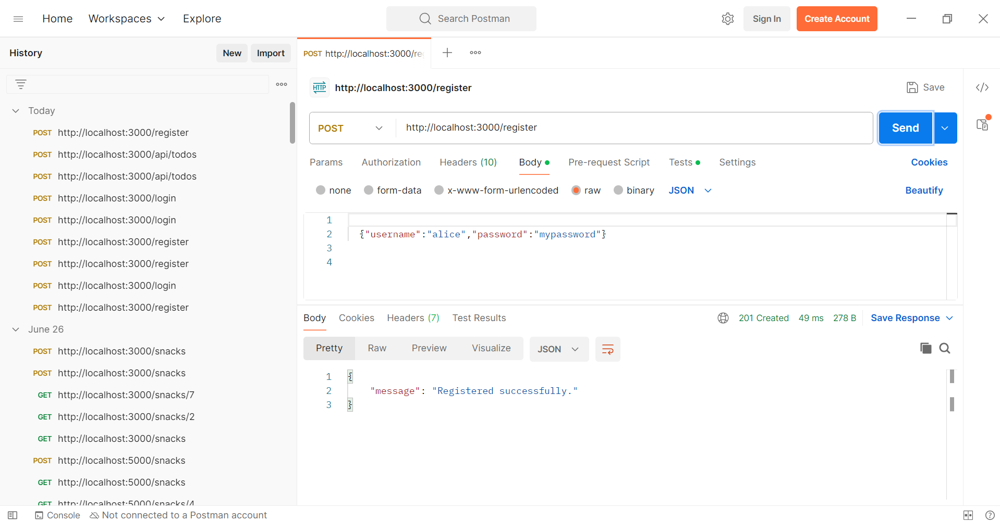
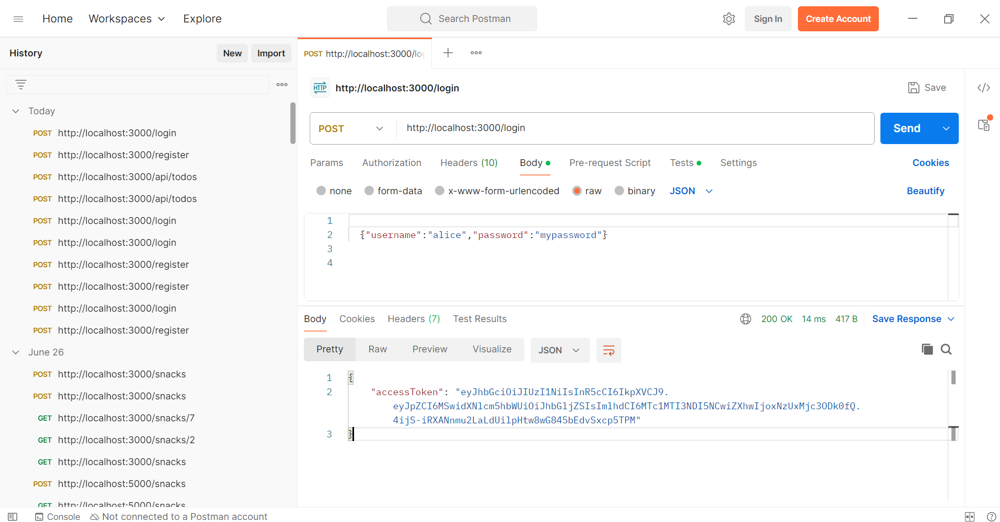
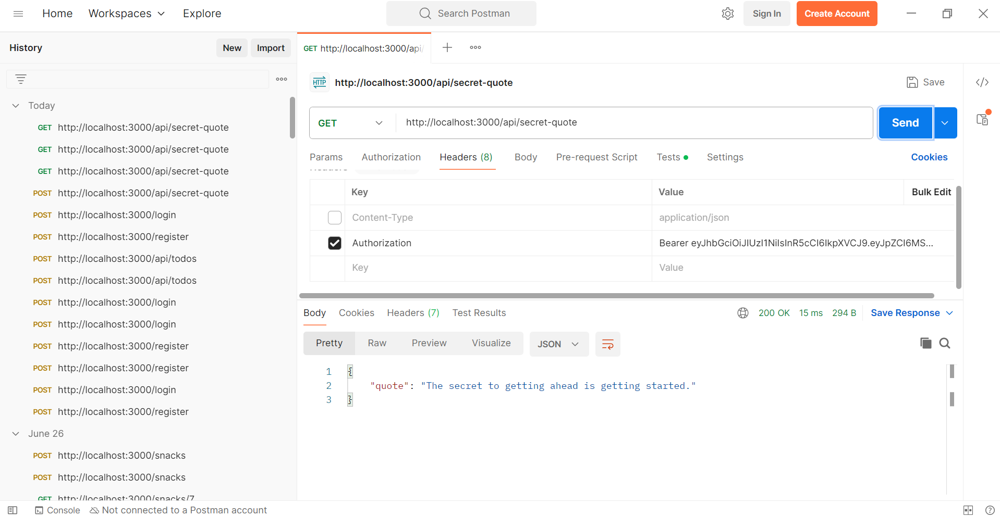
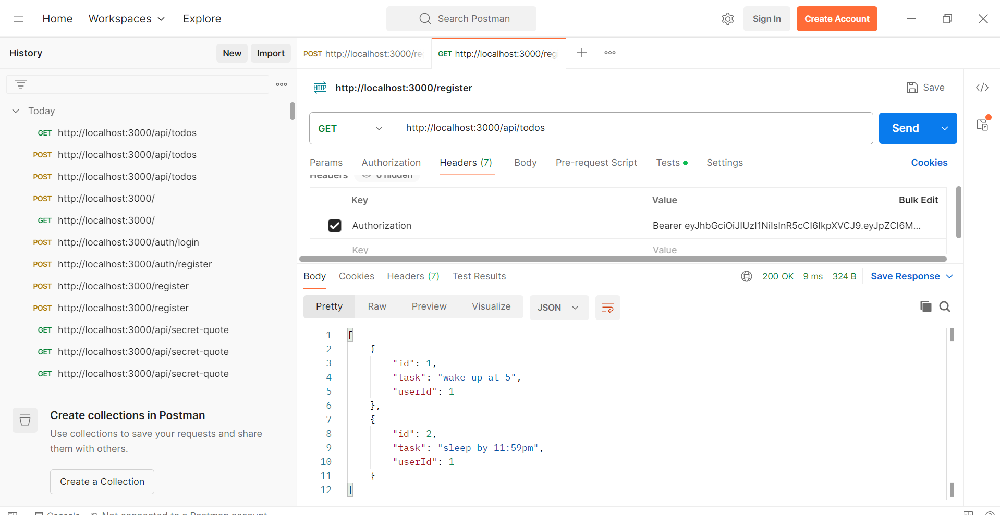
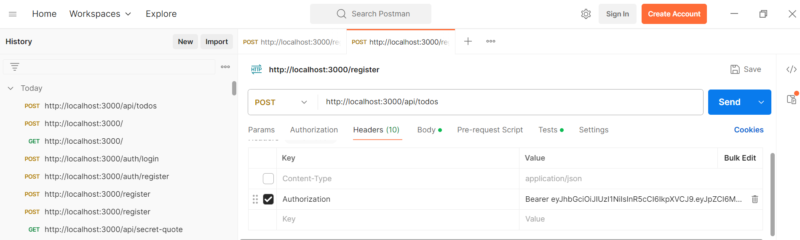
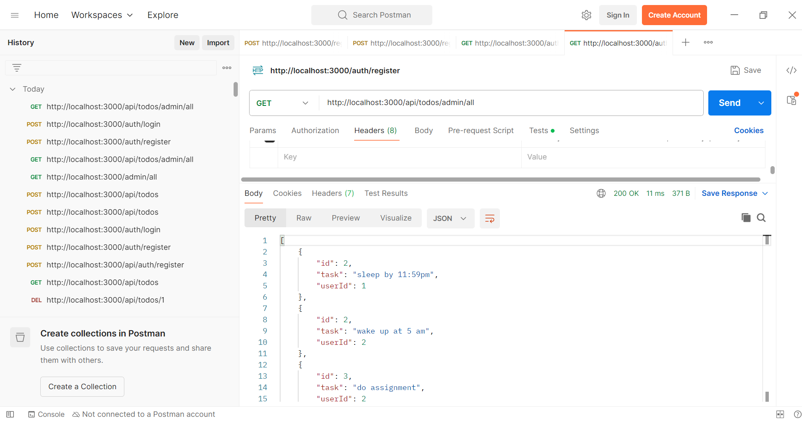
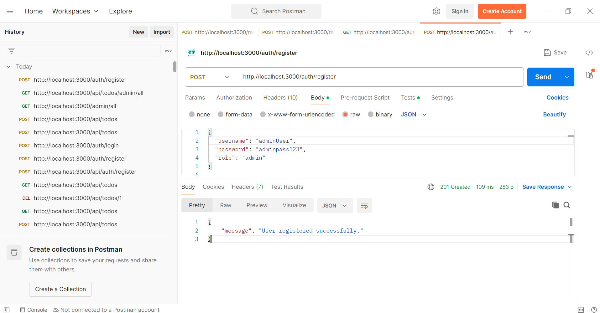
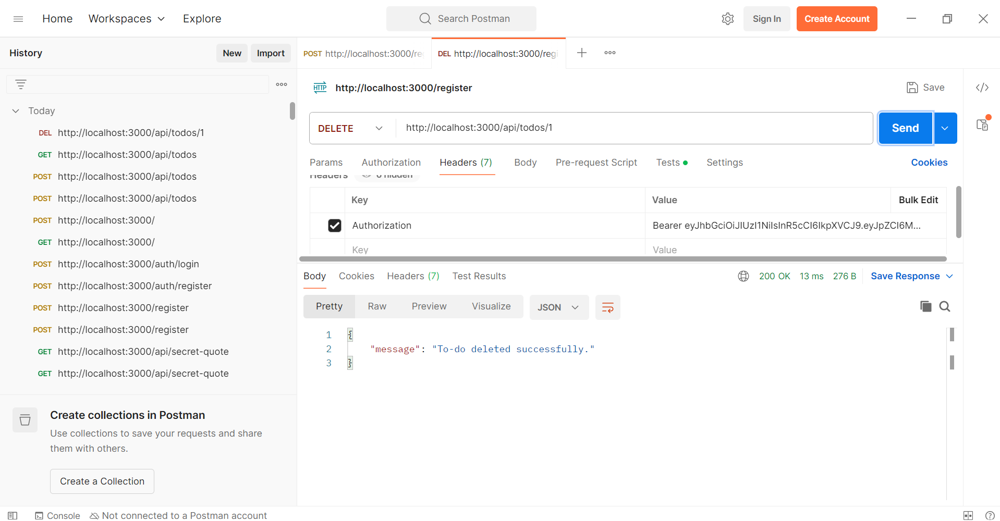
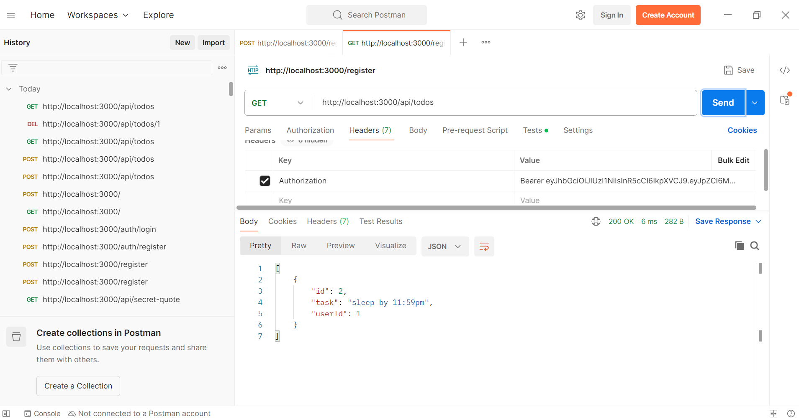

# This project demonstrate my understanding of stateless authentication by creating a secure backend API using JSON Web Tokens.

## 1. **Easy**: A "Secret Quote" API with basic JWT login.

### 1. **Project Setup:**
    - Initialize a new Node.js project (`npm init -y`).
    - Install `express` and `jsonwebtoken`.

### 2. **Start the Server:**
    - node server.js
    
### 3. **Created 2 endpoints:** 
    - Register     

    - Login

### 4. **Access the secret quote:**

## 2. **Medium**: A User-Specific "To-Do List" API.

A Node.js + Express REST API that allows secure user registration, login, and personal to-do management. Supports JWT authentication, bcrypt password hashing, and optional admin role-based access.

---

## Features

- Secure user registration & login (bcrypt + JWT)
- User-specific to-do list CRUD (in-memory storage)
- Passwords hashed with `bcrypt`
- JWT authentication middleware protects to-do routes
- **Bonus**: Admin role support allows viewing all users’ to-dos

---

## Tech Stack

- **Node.js** + **Express**
- `bcrypt` for password hashing
- `jsonwebtoken` for JWT-based auth
- In-memory arrays for users and to-dos (lightweight)

---

## Endpoints :
    - Get

    - Post

    - All

    - Admin

    - Delete 

